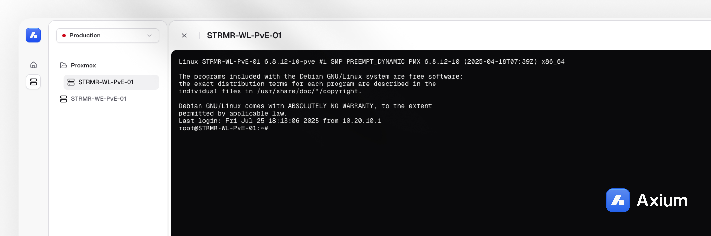

<div align="center">
  
  
  # Axium
  
  **The Open-Source Remote Server Management Platform**
  
  [](https://opensource.org/licenses/MIT)
  [](https://nodejs.org/)
  [](https://bun.sh/)
</div>

---

## 🚀 Overview

Axium is a modern, web-based platform that eliminates the need to switch between terminals and remote desktop applications. Access and manage all your servers from one beautiful, unified dashboard with real-time SSH terminal support.

### ✨ Key Features

- **🔐 Secure SSH Terminal**: Full-featured terminal with real-time connection management
- **🏗️ Multi-Environment Support**: Organize servers by environments (dev, staging, production)
- **👥 User Management**: Role-based access control and user administration
- **📁 Server Organization**: Folder-based server organization and management
- **🎨 Modern UI**: Beautiful, responsive interface built with Next.js and Tailwind CSS
- **⚡ Real-time**: WebSocket-powered real-time terminal connections
- **🔒 Authentication**: Secure authentication with Better Auth

## 🏗️ Architecture

This is a monorepo built with [Turborepo](https://turbo.build/repo) containing:

### Apps
- **`apps/core`** - Main dashboard application (Next.js 15)
- **`apps/web`** - Marketing website (Next.js 15)

### Packages
- **`packages/ui`** - Shared UI components (shadcn/ui)
- **`packages/typescript`** - TypeScript configurations

## 🛠️ Tech Stack

- **Framework**: Next.js 15 with App Router
- **Language**: TypeScript
- **Styling**: Tailwind CSS + shadcn/ui
- **Database**: PostgreSQL with Drizzle ORM
- **Authentication**: Better Auth
- **Terminal**: xterm.js with Socket.IO
- **SSH**: node-ssh
- **Package Manager**: Bun
- **Monorepo**: Turborepo

## 🚀 Quick Start

### Prerequisites

- Node.js 18+
- Bun 1.2.15+
- PostgreSQL database

### Installation

1. **Clone the repository**
   ```bash
   git clone https://github.com/your-username/axium.git
   cd axium
   ```

2. **Install dependencies**
   ```bash
   bun install
   ```

3. **Set up environment variables**
   ```bash
   cp apps/core/.env.example apps/core/.env
   # Edit the .env file with your configuration
   ```

4. **Set up the database**
   ```bash
   cd apps/core
   bun run db:generate
   bun run db:migrate
   ```

5. **Start the development server**
   ```bash
   # From the root directory
   bun run dev
   ```

The application will be available at:
- **Core App**: http://localhost:3000
- **Web App**: http://localhost:3001

## 📖 Usage

1. **Sign in** to your account
2. **Create environments** to organize your servers
3. **Add servers** with SSH credentials
4. **Connect** to servers through the web terminal
5. **Manage users** and permissions as needed

## 🔧 Development

### Available Scripts

```bash
# Development
bun run dev          # Start all apps in development mode
bun run build        # Build all apps and packages
bun run lint         # Lint all code
bun run format       # Format all code
bun run check-types  # Type check all packages

# Database (from apps/core)
bun run db:generate  # Generate database migrations
bun run db:migrate   # Run database migrations
bun run db:studio    # Open Drizzle Studio
```

### Project Structure

```
axium/
├── apps/
│   ├── core/          # Main dashboard application
│   └── web/           # Marketing website
├── packages/
│   ├── ui/            # Shared UI components
│   └── typescript/    # TypeScript configurations
└── README.md
```

## 🤝 Contributing

We welcome contributions! Please see our [Contributing Guide](CONTRIBUTING.md) for details.

1. Fork the repository
2. Create a feature branch (`git checkout -b feature/amazing-feature`)
3. Commit your changes (`git commit -m 'Add amazing feature'`)
4. Push to the branch (`git push origin feature/amazing-feature`)
5. Open a Pull Request

## 📄 License

This project is licensed under the MIT License - see the [LICENSE](LICENSE) file for details.

## 🆘 Support

- 📧 Email: support@axium.com
- 💬 Discord: [Join our community](https://discord.gg/axium)
- 📖 Documentation: [docs.axium.com](https://docs.axium.com)
- 🐛 Issues: [GitHub Issues](https://github.com/your-username/axium/issues)

---

<div align="center">
  Made with ❤️ by the Axium team
</div>
