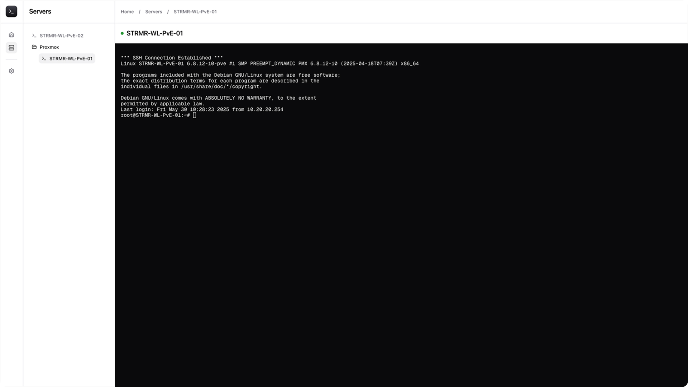

# Axium

A powerful, open-source remote server management platform for homelabbers and IT professionals. Take control of your server infrastructure with secure SSH, RDP, and VNC connections through a modern web interface.


## ✨ Features

- **🔐 Secure Connections**: SSH, RDP, and VNC terminal access
- **🌐 Web-based Interface**: Modern, responsive UI built with Next.js and Tailwind CSS
- **🔑 Credential Management**: Secure storage and management of server credentials
- **📱 Mobile-friendly**: Responsive design that works on all devices
- **🚀 Real-time Terminal**: Full-featured terminal with xterm.js
- **👤 User-Management**: Manage users and groups and assign permissions
- **🔒 Authentication**: Built-in user authentication and session management
- **📊 Server Management**: Organize and manage multiple servers efficiently

## 🏗️ Architecture

Axium is built as a monorepo using Turbo with the following structure:

```
axium/
├── apps/
│   ├── core/          # Main application (dashboard, terminal)
│   └── web/           # Public website and landing page
├── packages/
│   ├── ui/            # Shared UI components
│   ├── eslint/        # ESLint configurations
│   ├── typescript/    # TypeScript configurations
│   └── utils/         # Shared utilities
```

### Tech Stack

- **Frontend**: Next.js 15, React 19, TypeScript
- **Styling**: Tailwind CSS, Radix UI, Shadcn/ui
- **Terminal**: xterm.js with Socket.IO
- **Database**: Drizzle ORM with PostgreSQL
- **Authentication**: Better Auth
- **Build Tool**: Turbo
- **Package Manager**: Bun

## 🚀 Quick Start

### Prerequisites

- Node.js >= 18
- Bun >= 1.2.15
- PostgreSQL database

### Installation

1. **Clone the repository**

   ```bash
   git clone https://github.com/felixstrmr/axium.git
   cd axium
   ```

2. **Install dependencies**

   ```bash
   bun install
   ```

3. **Set up environment variables**

   ```bash
   # Copy example environment files
   cp apps/core/.env.example apps/core/.env
   cp apps/web/.env.example apps/web/.env
   ```

4. **Set up the database**

   ```bash
   # Generate and run migrations
   bun run db:generate
   bun run db:migrate
   ```

5. **Start the development servers**
   ```bash
   bun run dev
   ```

The applications will be available at:

- **Core App**: http://localhost:3000
- **Web App**: http://localhost:3001

## 🔧 Development

### Project Structure

- **`apps/core/`**: Main dashboard application with all functionalities
- **`apps/web/`**: Public website and authentication
- **`packages/ui/`**: Reusable UI components and design system
- **`packages/utils/`**: Shared utilities and database helpers

## 🤝 Contributing

We welcome contributions! Please see our [Contributing Guide](CONTRIBUTING.md) for details.

1. Fork the repository
2. Create a feature branch (`git checkout -b feature/amazing-feature`)
3. Commit your changes (`git commit -m 'Add amazing feature'`)
4. Push to the branch (`git push origin feature/amazing-feature`)
5. Open a Pull Request
